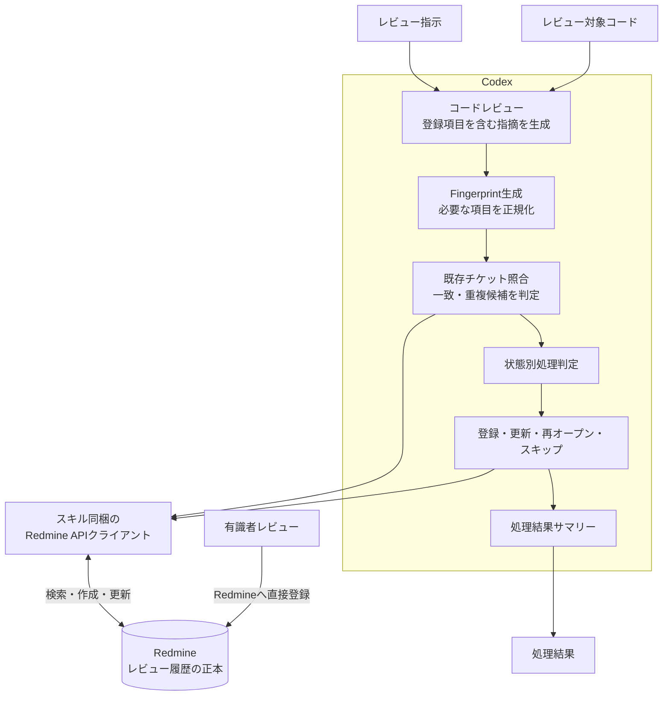

# Redmine Review Findings Skill

Codexがレビュー指摘を既存の履歴と照合し、Redmineへ反映するためのスキルを配布するプロジェクトです。

レビュー観点とレビュー範囲はこの処理では定義しません。Codexが生成したレビュー指摘に対して、既存指摘との照合、状態に応じた処理、Redmineへの反映、および処理結果の出力を行います。

## 処理構成



## この処理で行うこと

- Codexによるコードレビューと登録項目を含む指摘の生成
- Fingerprintの生成
- Redmine上の既存チケットとの照合
- 既存ステータスに応じた登録、更新、再オープン、スキップ
- Redmineへの反映と処理結果の出力

以下はこの処理では定義しません。

- レビュー観点の決定
- レビュー範囲の決定
- 有識者による最終判断

## 既存チケットとの照合

同じ指摘の二重登録を防ぐため、以下の情報からFingerprintを生成します。

- Repository
- Rule ID
- File Path
- Symbol
- Normalized Code Context

Fingerprintが完全一致した場合は同じ指摘として既存チケットを更新します。

Rule ID、File Path、Symbolのみが一致した場合は重複候補として扱い、自動的には統合しません。Fingerprintは完全一致を判定するための技術的な識別子であり、問題の意味的な同一性を判断するものではありません。

## 主な状態処理

- 未対応の既存チケットを再検出した場合は、状態を維持して最終検出情報と検出回数を更新する
- 「修正済み」の指摘を再検出した場合は、再発として「確認中」へ戻す
- 「重複」の指摘を再検出した場合は、重複元のチケットを更新する
- 「対応不要」「リスク受容」「保留」「取下げ」はCodexが妥当性を再評価しない
- 有識者レビューはCodexレビューより優先し、Codexによる自動変更の対象にしない

## Redmine連携

- レビュー履歴の正本はRedmineとする
- Codexレビュー、有識者レビュー、静的解析結果は同じトラッカーで管理する
- Redmineの操作にはスキル同梱のAPIクライアントを使用する
- Redmineの内部IDや認証情報をコードへ埋め込まない
- 処理後は登録、更新、再発、スキップ、エラーなどの件数を出力する

## Redmineの事前準備

### プロジェクトとトラッカー

- レビュー指摘を管理するRedmineプロジェクトを用意する
- Codexレビュー、有識者レビュー、静的解析結果で共通して使用するトラッカーを用意する
- RedmineのREST APIを有効にする

タイトル、詳細説明、修正案、重要度、カテゴリは、可能な限りRedmineの標準項目を使用します。

| レビュー項目 | Redmine項目 |
| --- | --- |
| タイトル | 題名 |
| 詳細説明・修正案 | 説明 |
| 重要度 | 優先度 |
| カテゴリ | チケットのカテゴリ |
| 状態 | ステータス |

### ステータス

以下のステータスを用意します。

| ステータス | Redmine上の扱い |
| --- | --- |
| 新規 | 未完了 |
| 確認中 | 未完了 |
| 対応対象 | 未完了 |
| 対応中 | 未完了 |
| 修正確認中 | 未完了 |
| 保留 | 未完了 |
| 修正済み | 完了 |
| 対応不要 | 完了 |
| リスク受容 | 完了 |
| 重複 | 完了 |
| 取下げ | 完了 |

Redmineのワークフロー設定で、Codexが使用するAPIユーザーに必要な更新を許可します。少なくとも、新規チケットの登録、既存チケットの更新、および「修正済み」から「確認中」への変更が必要です。

### カスタムフィールド

以下のチケット用カスタムフィールドを用意します。

| 項目 | 推奨形式 | 用途 |
| --- | --- | --- |
| ルールID | テキスト | 指摘ルールの識別 |
| リポジトリ | リストまたはテキスト | 対象リポジトリの識別 |
| ベースブランチ | テキスト | 比較元ブランチ |
| ターゲットブランチ | テキスト | 比較先ブランチ |
| コミットSHA | テキスト | 検出時のCommit |
| ファイルパス | テキスト | 対象ファイル |
| シンボル | テキスト | 対象クラス、関数、メソッドなど |
| 行番号 | 整数 | 検出位置 |
| Fingerprint | テキスト | 同一指摘の完全一致検索 |
| レビュー生成元 | リスト | Codex、有識者、静的解析の識別 |
| 初回検出日時 | テキスト | 最初に検出した日時をISO 8601形式で保持 |
| 最終検出日時 | テキスト | 最後に検出した日時をISO 8601形式で保持 |
| 最終検出Commit | テキスト | 最後に検出したCommit |
| 検出回数 | 整数 | 同一指摘の検出回数 |
| 再発回数 | 整数 | 修正済み後の再発回数 |
| AI信頼度 | 整数（0～100） | Codexレビューの信頼度 |

Fingerprint、ルールID、ファイルパス、シンボルは「フィルタとして使用」を有効にし、Redmineの一覧画面とREST APIから検索できる設定にします。FingerprintはCodexレビューと静的解析では必須とし、有識者がRedmineへ直接登録する場合は任意とします。

レビュー生成元の選択肢には「Codex」「有識者」「静的解析」を設定します。有識者レビューでも、FingerprintとAI信頼度を除く照合用項目を入力します。

Redmineの優先度を重要度として使用するため、Codexが出力する重要度との対応関係を設定します。

「重複」になったチケットと重複元チケットの対応には、カスタムフィールドではなくRedmineのチケット間の関連を使用します。重複候補はチケットの注記へ記録します。

### APIユーザー

Codexが使用する専用APIユーザーを用意し、対象プロジェクトに以下の権限を付与します。

- チケットの閲覧
- チケットの追加
- チケットの編集
- 注記の追加
- チケット間の関連の追加

APIキーはGit管理対象外の`config/redmine.json`、環境変数、またはSecret管理機構で管理します。プロジェクト、トラッカー、ステータス、カスタムフィールドは名称または設定上の識別子から解決し、内部IDをコードへ直接記述しません。

## 想定フォルダ構成

```text
TaskManage/
├── AGENTS.md
├── README.md
├── skills/
│   └── manage-redmine-review-findings/
│       ├── SKILL.md
│       ├── agents/
│       │   └── openai.yaml
│       ├── config/
│       │   ├── .gitignore
│       │   └── redmine.example.json
│       ├── scripts/
│       │   ├── check_redmine_setup.py
│       │   ├── manage_findings.py
│       │   └── redmine_common.py
│       └── references/
│           ├── redmine-setup.md
│           └── status-policy.md
```

| パス | 役割 |
| --- | --- |
| `SKILL.md` | Codexが従うレビュー・Redmine反映ワークフロー |
| `agents/openai.yaml` | スキル一覧に表示する名称、説明、既定プロンプト |
| `config/redmine.example.json` | Git管理するRedmine設定例 |
| `config/redmine.json` | 利用者が作成するローカル設定。Git管理対象外 |
| `scripts/check_redmine_setup.py` | Redmineのプロジェクト、トラッカー、ステータス、項目を確認 |
| `scripts/manage_findings.py` | 指摘の照合、登録、更新、再オープン、結果集計 |
| `scripts/redmine_common.py` | Fingerprint生成とRedmine REST API共通処理 |
| `references/redmine-setup.md` | Redmine設定と入出力データの詳細 |
| `references/status-policy.md` | ステータス別の処理規則 |

コードレビューそのものはCodexが行うため、レビューエンジンやプロンプトは実装しません。

## インストール

配布先で、`skills/manage-redmine-review-findings`をCodexのskillsディレクトリへコピーします。

```bash
cp -R skills/manage-redmine-review-findings ~/.codex/skills/
```

インストール後は、プロンプトから`$manage-redmine-review-findings`を指定して使用できます。

インストール後、`config/redmine.example.json`を`config/redmine.json`へコピーしてRedmine接続設定を記入します。APIキーも`redmine.json`へ保存できますが、ファイル権限を`600`にする必要があります。CIでは`REDMINE_API_KEY`環境変数を使用でき、設定ファイルより優先されます。設定例と入力形式は、[Redmine設定リファレンス](./skills/manage-redmine-review-findings/references/redmine-setup.md)を参照してください。

レビュー処理の前には、読み取り専用の設定確認を毎回実行します。

```bash
python3 skills/manage-redmine-review-findings/scripts/check_redmine_setup.py
```

この確認はGETリクエストだけを使用し、前提項目が不足している場合や確認できない場合は、Redmineへ指摘を反映せず終了します。書き込み権限とワークフロー遷移権限はGETだけでは完全に確認できないため、実際の反映時にRedmineから拒否された場合は処理エラーとして扱います。

## 開発時の確認

```bash
python3 -m py_compile \
  skills/manage-redmine-review-findings/scripts/*.py
python3 /path/to/skill-creator/scripts/quick_validate.py \
  skills/manage-redmine-review-findings
```
