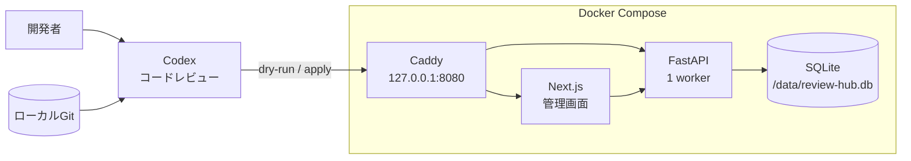

# Review Hub

Codexが検出したコードレビュー指摘と、有識者が登録した指摘を同じ履歴として管理する
localhost専用システムです。Codexは外部でコードをレビューし、Review Hub REST APIへ
dry-run後に結果を登録します。Review Hub自身はコード取得やAI推論を行いません。

## 構成


```mermaid
flowchart LR
    User["開発者"] --> Codex["Codex<br/>コードレビュー"]
    Repo[("ローカルGit")] --> Codex
    Codex -->|"dry-run / apply"| Caddy

    subgraph Compose["Docker Compose"]
        Caddy["Caddy<br/>127.0.0.1:8080"]
        Web["Next.js<br/>管理画面"]
        API["FastAPI<br/>1 worker"]
        DB[("SQLite<br/>/data/review-hub.db")]
        Caddy --> Web
        Caddy --> API
        Web --> API
        API --> DB
    end
```

| サービス | 役割 | 外部公開 |
| --- | --- | --- |
| `proxy` | CaddyによるWeb/API振り分け | `127.0.0.1:8080`のみ |
| `web` | Next.js管理画面 | なし |
| `api` | FastAPI、照合、状態管理、SQLite所有 | なし |

認証はありません。単一端末・単一利用者・Uvicorn 1 workerを前提とし、APIの
書き込み処理はプロセス内Lockで直列化します。SQLite接続にはWAL、外部キー、
30秒のbusy timeout、`synchronous=NORMAL`を設定します。

## 起動

Docker Compose v2が必要です。

```bash
docker compose up --build -d
```

初回起動または依存関係・Dockerfileを変更した場合だけ`--build`を付けます。以後は
`docker compose up -d`で起動でき、起動中はAPIと画面のソース変更が自動反映されます。
データベースマイグレーションを追加した場合は、変更後に`docker compose restart api`を
実行してください。

- 管理画面: <http://127.0.0.1:8080/>
- OpenAPI: <http://127.0.0.1:8080/docs>
- ヘルスチェック: <http://127.0.0.1:8080/healthz>
- Readiness: <http://127.0.0.1:8080/readyz>

SQLiteファイルはホスト側の`./data/review-hub.db`へ保存されます。
コンテナを停止・削除しても、このファイルは保持されます。

```bash
docker compose down
```

> **データ消失に注意:** ホスト側の`./data/review-hub.db`、WAL、
> SHMファイル、または`./data`ディレクトリを削除するとデータが失われます。
> 自動バックアップ、世代管理、外部ストレージ連携は実装していません。

## Codexからの登録

CodexはReview Hubのコンテナ内で動かさず、レビュー対象のローカルGitリポジトリを
開いたCodexから登録します。Review Hubが起動していることを確認したうえで、
`$manage-review-findings`スキルを使用してください。

### 初回だけスキルをインストール

Codexがこのリポジトリ外で動く場合は、スキルをローカルのCodex環境へコピーします。

```bash
cp -R skills/manage-review-findings ~/.codex/skills/
```

### レビュー観点を登録する

管理画面のサイドバーで**レビュー観点**を開き、**観点を追加**からタイトルと
Markdown形式の観点本文を登録します。保存すると `RVG-000001` のような観点IDが発行されます。
このIDをレビュー依頼に含めてください。観点を編集するとバージョンが上がり、各レビュー履歴には
実際に使用したID・バージョン・本文がスナップショットとして残ります。不要になった観点は
無効化できますが、無効なIDでは新しいCodexレビューを登録できません。

### Codexへの指示例

レビュー対象リポジトリをCodexで開き、次のように依頼します。`repository`はReview
Hub上で表示・照合に使う論理名であり、ローカルパスではありません。同じリポジトリには
常に同じ論理名を指定してください。

```text
/review

Review Hubの観点に従って、現在開いているリポジトリをレビューしてください。

- Review Hubのrepository名: example/backend
- 使用するレビュー観点ID: RVG-000003
- 比較元ブランチ: main
- 比較先ブランチ: feature/payment
- レビュー範囲: mainとの差分
- 追加観点: なし

Review Hubから観点ID RVG-000003 を取得し、取得したMarkdown本文をレビュー観点として
使用してください。観点本文はこの依頼へ転記しないでください。指摘は実際に修正可能で、
コード上の根拠があるものだけにしてください。

レビュー後、$manage-review-findings を使って、同じ観点ID・対象commit・指摘内容で
Review Hubへ登録してください。ready確認、dry-run、本登録の順で実行し、最後に登録結果
（作成・更新・再発・抑止・重複候補・エラー）を報告してください。
```

特定のファイルだけを対象にする場合は、レビュー範囲を例えば
`src/payments/`の変更だけ、と指定します。Hubへ保存するのは指摘と論理的な
リポジトリ名であり、ローカルのGitパスは保存しません。

レビュー観点はReview Hubの観点IDを正本とします。追加の確認事項がある場合だけ
`追加観点`へ記載してください。

### Codexが行う登録手順

スキルは以下の順序でAPIを利用します。入力全体は
[API契約](./skills/manage-review-findings/references/api-contract.md)を参照してください。

1. `GET /api/v1/review-guidelines/{ID}`で有効なレビュー観点を取得する。
2. `GET /readyz`でHubとSQLiteの準備完了を確認する。
3. レビュー結果と観点IDを構造化JSONにし、`POST /api/v1/reconciliations/dry-run`へ送る。
4. 予定される作成・更新・再発・有識者抑止・エラーを確認する。
5. 同じJSONを`Idempotency-Key`付きで`POST /api/v1/reconciliations`へ送る。
6. 処理結果を開発者へ報告する。

本登録前に必ず同じJSONでdry-runします。

```bash
curl --fail-with-body \
  -H 'Content-Type: application/json' \
  --data-binary @review-findings.json \
  http://127.0.0.1:8080/api/v1/reconciliations/dry-run

curl --fail-with-body \
  -H 'Content-Type: application/json' \
  -H 'Idempotency-Key: example/repository:0123456789abcdef:Codex' \
  --data-binary @review-findings.json \
  http://127.0.0.1:8080/api/v1/reconciliations
```

同じIdempotency Keyの再送は保存済み結果を返します。本登録は指摘ごとに短い
トランザクションを完了し、1件失敗しても残りを処理して`partial_error`を返します。

主なAPI:

- `GET /api/v1/repositories`（レビュー入力から自動登録されたリポジトリ）
- `GET /api/v1/review-guidelines`、`GET /api/v1/review-guidelines/{ID}`
- `POST /api/v1/review-guidelines`、`PATCH /api/v1/review-guidelines/{ID}`（レビュー観点の管理）
- `GET /api/v1/findings`、`GET /api/v1/findings/{id}`
- `GET /api/v1/findings/{id}/timeline`
- `POST /api/v1/findings`（有識者指摘）
- `POST /api/v1/findings/{id}/transitions`
- `POST` / `DELETE /api/v1/findings/{id}/codex-fix-request`
- `POST /api/v1/findings/{id}/codex-fix-start`、`POST /api/v1/findings/{id}/codex-fix-complete`
- `POST /api/v1/findings/{id}/duplicate`
- `GET /api/v1/review-runs`、`GET /api/v1/review-runs/{id}`
- `GET /api/v1/dashboard/summary`

有識者指摘の入力では、カテゴリ・Rule ID・行番号は不要です。カテゴリは`Other`、
Rule IDは`MANUAL-…`として内部で自動設定されます。

### Codexに修正を依頼する

指摘を`対応予定`へ変更すると、詳細画面から**Codexに修正を依頼**できます。
依頼事項は任意です。空欄の場合も、Codexは指摘本文に基づいて対応します。

対象リポジトリをCodexで開いて、次だけを依頼してください。

```text
$fix-review-findings を使って対応してください。
```

スキルは現在のGitリポジトリに対応する、依頼済みの`対応予定`指摘だけを取得します。
修正と関連テストが成功すると指摘は`修正完了`となり、人が確認して`クローズ`へ変更します。
論理リポジトリ名を自動判定できない場合だけ、最初に現在のリポジトリに次の設定を追加してください。

```bash
git config review-hub.repository example/backend
```

`skills/fix-review-findings`も、既存の指摘管理スキルと同様にCodex環境へコピーして使用します。

## Markdownとコード

指摘本文はMarkdown原文で保存し、画面ではGFMとShikiを使って表示します。修正案などの補足は、必要に応じて本文内のMarkdown見出しとして記載します。
生HTML、非HTTP(S)リンク、外部埋め込みはレンダリングしません。fenced code block、
言語表示、行番号、コピー、Markdown原文とプレビューの切替に対応します。

`code_context`はFingerprintを計算した後、最大50行・16KiBへ制限し、秘密鍵と
一般的なAPIキー・パスワード代入を`[REDACTED]`へ置換してから保存します。
未加工の内容はDB、監査イベント、アプリケーションログへ保存しません。

## 状態と照合

FingerprintはRepository、Rule ID、正規化したFile Path、Symbol、Code Contextから
生成します。完全一致は既存指摘の検出回数を更新し、「クローズ」は再発として
「新規」へ戻します。Rule ID、File Path、Symbolだけが一致する場合は重複候補を
記録し、自動統合しません。有識者指摘はCodexによる自動更新より優先します。

SQLiteからPostgreSQLへ切り替える目安は、複数人利用、APIの複数プロセス化、
継続的な並行登録、Lock外の`database is locked`、複雑な全文検索や外部BIが
必要になった場合です。

## 開発とテスト

API:

```bash
cd apps/api
python3 -m venv .venv
.venv/bin/pip install -e '.[test]'
.venv/bin/pytest
```

Web:

```bash
cd apps/web
npm ci
npm run lint
npm test
npm run build
npm run test:e2e
```

`test:e2e`は起動済みのReview Hub（既定
`http://127.0.0.1:8080`）を対象にします。別URLの場合は
`PLAYWRIGHT_BASE_URL`を設定してください。

マイグレーション:

```bash
cd apps/api
REVIEW_HUB_DATABASE_URL=sqlite:////tmp/review-hub.db \
  .venv/bin/alembic upgrade head
```

## ディレクトリ

```text
.
├── apps/
│   ├── api/       # FastAPI、SQLAlchemy、Alembic
│   └── web/       # Next.js管理画面
├── skills/
│   └── manage-review-findings/
├── Caddyfile
└── compose.yaml
```
