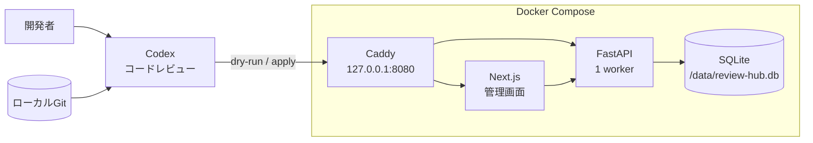

# Review Hub

Codexが検出したコードレビュー指摘と、有識者が登録した指摘を同じ履歴として管理する
localhost専用システムです。Codexは外部でコードをレビューし、Review Hub REST APIへ
dry-run後に結果を登録します。Review Hub自身はコード取得やAI推論を行いません。

## 構成


```mermaid
flowchart LR
    User["開発者"] --> Codex["Codex<br/>コードレビュー"]
    Repo[("ローカルGit")] --> Codex
    Codex -->|"dry-run / apply"| Caddy

    subgraph Compose["Docker Compose"]
        Caddy["Caddy<br/>127.0.0.1:8080"]
        Web["Next.js<br/>管理画面"]
        API["FastAPI<br/>1 worker"]
        DB[("SQLite<br/>/data/review-hub.db")]
        Caddy --> Web
        Caddy --> API
        Web --> API
        API --> DB
    end
```

| サービス | 役割 | 外部公開 |
| --- | --- | --- |
| `proxy` | CaddyによるWeb/API振り分け | `127.0.0.1:8080`のみ |
| `web` | Next.js管理画面 | なし |
| `api` | FastAPI、照合、状態管理、SQLite所有 | なし |

認証はありません。単一端末・単一利用者・Uvicorn 1 workerを前提とし、APIの
書き込み処理はプロセス内Lockで直列化します。SQLite接続にはWAL、外部キー、
30秒のbusy timeout、`synchronous=NORMAL`を設定します。

## 起動

Docker Compose v2が必要です。

```bash
APP_OPERATOR_NAME=your-name docker compose up --build -d
```

- 管理画面: <http://127.0.0.1:8080/>
- OpenAPI: <http://127.0.0.1:8080/docs>
- ヘルスチェック: <http://127.0.0.1:8080/healthz>
- Readiness: <http://127.0.0.1:8080/readyz>

停止してもnamed volumeのSQLiteデータは保持されます。

```bash
docker compose down
```

> **データ消失に注意:** `docker compose down -v`、`docker volume rm`、
> Docker Desktopのボリューム削除を行うと全データが失われます。
> 自動バックアップ、世代管理、外部ストレージ連携は実装していません。

## Codexからの登録

入力全体は[API契約](./skills/manage-review-findings/references/api-contract.md)を
参照してください。本登録前に必ず同じJSONでdry-runします。

```bash
curl --fail-with-body \
  -H 'Content-Type: application/json' \
  --data-binary @review-findings.json \
  http://127.0.0.1:8080/api/v1/reconciliations/dry-run

curl --fail-with-body \
  -H 'Content-Type: application/json' \
  -H 'Idempotency-Key: example/repository:0123456789abcdef:Codex' \
  --data-binary @review-findings.json \
  http://127.0.0.1:8080/api/v1/reconciliations
```

同じIdempotency Keyの再送は保存済み結果を返します。本登録は指摘ごとに短い
トランザクションを完了し、1件失敗しても残りを処理して`partial_error`を返します。

主なAPI:

- `GET /api/v1/findings`、`GET /api/v1/findings/{id}`
- `GET /api/v1/findings/{id}/timeline`
- `POST /api/v1/findings`（有識者指摘）
- `POST /api/v1/findings/{id}/transitions`
- `POST /api/v1/findings/{id}/duplicate`
- `GET /api/v1/review-runs`、`GET /api/v1/review-runs/{id}`
- `GET /api/v1/dashboard/summary`

## Markdownとコード

説明と修正案はMarkdown原文で保存し、画面ではGFMとShikiを使って表示します。
生HTML、非HTTP(S)リンク、外部埋め込みはレンダリングしません。fenced code block、
言語表示、行番号、コピー、Markdown原文とプレビューの切替に対応します。

`code_context`はFingerprintを計算した後、最大50行・16KiBへ制限し、秘密鍵と
一般的なAPIキー・パスワード代入を`[REDACTED]`へ置換してから保存します。
未加工の内容はDB、監査イベント、アプリケーションログへ保存しません。

## 状態と照合

FingerprintはRepository、Rule ID、正規化したFile Path、Symbol、Code Contextから
生成します。完全一致は既存指摘の検出回数を更新し、「修正済み」は再発として
「確認中」へ戻します。Rule ID、File Path、Symbolだけが一致する場合は重複候補を
記録し、自動統合しません。有識者指摘はCodexによる自動更新より優先します。

SQLiteからPostgreSQLへ切り替える目安は、複数人利用、APIの複数プロセス化、
継続的な並行登録、Lock外の`database is locked`、複雑な全文検索や外部BIが
必要になった場合です。

## Redmineからの一度限りの移行

移行はAPIサービスを停止した状態で実行します。設定形式は既存Redmineスキルの
`config/redmine.example.json`を利用できます。

```bash
docker compose stop api
docker compose run --rm api redmine-import \
  --config /path/in/container/redmine.json --dry-run
docker compose run --rm api redmine-import \
  --config /path/in/container/redmine.json --apply
docker compose start api
```

実ファイルを渡す場合は`docker compose run`へ読み取り専用volume指定を追加して
ください。`legacy_redmine_issue_id`により再実行を冪等化します。Fingerprint衝突、
未知ステータス、解決できない重複元がある場合はapply全体を中止します。

## 開発とテスト

API:

```bash
cd apps/api
python3 -m venv .venv
.venv/bin/pip install -e '.[test]'
.venv/bin/pytest
```

Web:

```bash
cd apps/web
npm ci
npm run lint
npm test
npm run build
npm run test:e2e
```

`test:e2e`は起動済みのReview Hub（既定
`http://127.0.0.1:8080`）を対象にします。別URLの場合は
`PLAYWRIGHT_BASE_URL`を設定してください。

マイグレーション:

```bash
cd apps/api
REVIEW_HUB_DATABASE_URL=sqlite:////tmp/review-hub.db \
  .venv/bin/alembic upgrade head
```

スキルを配布先へインストールする場合:

```bash
cp -R skills/manage-review-findings ~/.codex/skills/
```

## ディレクトリ

```text
.
├── apps/
│   ├── api/       # FastAPI、SQLAlchemy、Alembic、Redmine移行
│   └── web/       # Next.js管理画面
├── skills/
│   ├── manage-review-findings/
│   └── manage-redmine-review-findings/  # 移行確認用
├── Caddyfile
└── compose.yaml
```
